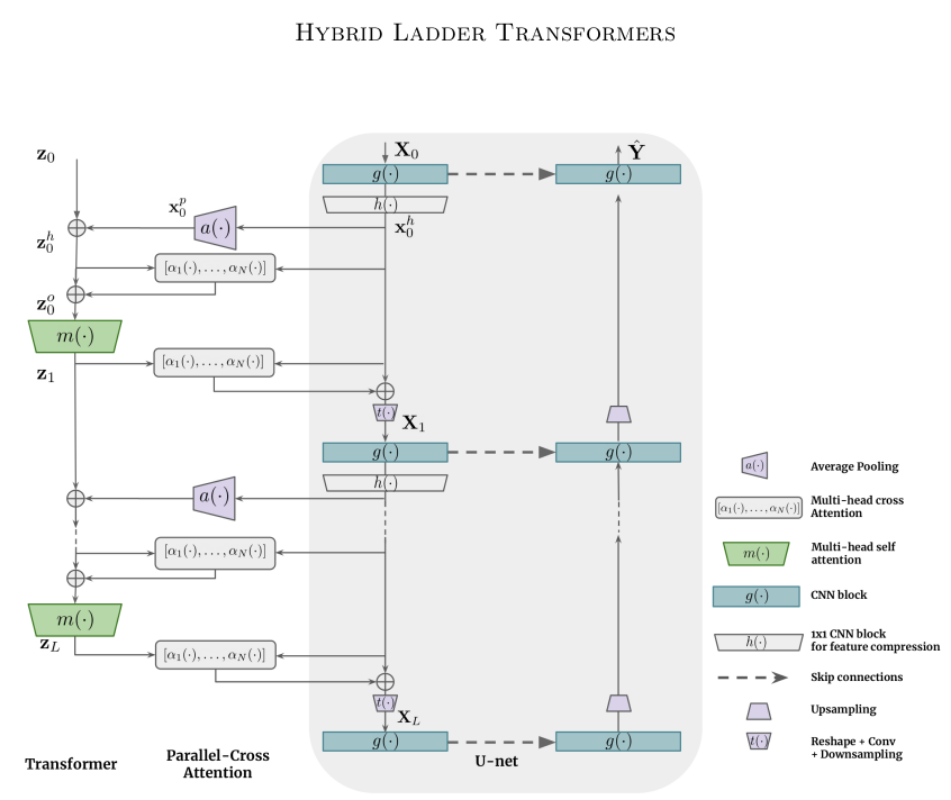

# README #

This is the official Pytorch implementation of 
"[Hybrid Ladder Transformers with Efficient Parallel-Cross Attention for Medical Image Segmentation](https://openreview.net/forum?id=swvVpnzro9q)", Haozhe Luo et al. 2021


### What is this repository for? ###

* Train the hybrid ladder transformer from scratch
* Train some of the other baseline models described in the paper
* v1.0

### How do I get set up? ###

* Basic Pytorch dependency
* Tested on Pytorch 1.3, Python 3.6 
* Train the model from scratch: 
python train.py

### Usage guidelines ###

* Kindly cite our publication if you use any part of the code
```
@misc{haozhe2021LadderTransformer,
 	title={Hybrid Ladder Transformers with Efficient Parallel-Cross Attention for Medical Image Segmentation},
	author={Haozhe Luo and Yu Changdong and  Raghavendra Selvan},
	howpublished={Openreview},
	month={December},
 	note={Preprint on Openreview},
	url={https://openreview.net/forum?id=swvVpnzro9q},
	year={2021}}
```

### Who do I talk to? ###

* Haozhe Luo: luohaozhe@stu.scu.edu.cn

### Thanks
Baseline implementations were based on the following repositories:
* [Dense Prediction Transformer](https://github.com/isl-org/DPT)
* [TranUnet](https://github.com/Beckschen/TransUNet)
* [Swin-Unet](https://github.com/HuCaoFighting/Swin-Unet)


